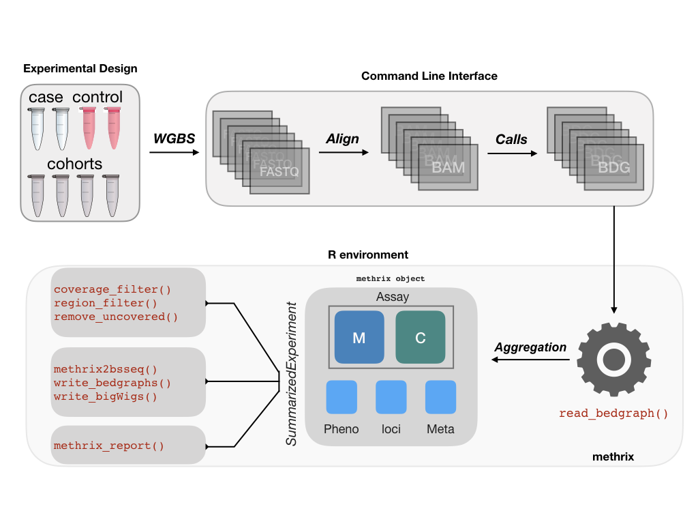

```{r setup, include = FALSE}
knitr::opts_chunk$set(
  collapse = TRUE,
  comment = "#>"
)
```

## Introduction
This vignette describes basic usage of the package intended to process several large [bedgraph](https://genome.ucsc.edu/goldenPath/help/bedgraph.html) files in R. `Methrix` provides set of function which allows easy importing of various flavours of bedgraphs generated by methylation callers, and many downstream analysis to be performed on large matrices.



## Reading bedgraph files
`read_bedgraphs` function is a versatile bedgraph reader intended to import bedgraph files generated virtually by any sort of methylation calling program. It requires user to provide indices for chromosome names, start position and other required fields. There are also presets available to import `bedgraphs` from most common programs such as `Bismark`, `MethylDackel`, and `MethylcTools`.

```{r, message=FALSE, warning=FALSE}
#Load library
library(methrix)
#Genome of your preference to work with
library(BSgenome.Mmusculus.UCSC.mm9) 
```


```{r}
#Example bedgraph files
bdg_files = list.files(
  path = system.file('extdata', package = 'methrix'),
  pattern = "*bdg\\.gz$",
  full.names = TRUE
)

print(bdg_files)
```

We can import bedgraph files with the function `read_bedgraphs` which reads in the bedgraphs, adds CpGs missing from the reference set, and creates a methylation/coverage matrices. If your system has enough memory increasing `vect_batch_size` and `n_threads` speeds up the process. Once the process is complete - it returns an object of class `methrix` which in turn inherits [SummarizedExperiment](https://bioconductor.org/packages/release/bioc/vignettes/SummarizedExperiment/inst/doc/SummarizedExperiment.html) class. `methrix` object contains 'methylation' and 'coverage' matrices (either in-memory or as on-disk HDF5 arrays) along with pheno-data and other basic info. This object can be passed to all downstream functions for various analysis.

Bedgraphs used for vignette are generated with [BSMAP](https://bmcbioinformatics.biomedcentral.com/articles/10.1186/1471-2105-10-232) from bam files aligned to `mm9` reference genome. 

```{r, warning=FALSE}
#First extract genome wide CpGs from the desired genome
mm9_cpgs = methrix::extract_CPGs(ref_genome = "BSgenome.Mmusculus.UCSC.mm9", bored = FALSE)
```

```{r}
#Read the files
meth = methrix::read_bedgraphs(
  files = bdg_files,
  ref_cpgs = mm9_cpgs,
  chr_idx = 1,
  start_idx = 2,
  end_idx = 3,
  cov_idx = 4,
  beta_idx = 5,
  stranded = TRUE,
  collapse_strands = TRUE,
  zero_based = FALSE
)
```

Note: Use argument `pipeline` if your bedgraphs are generated with "Bismark", "MethylDeckal", or "MethylcTools".

```{r}
#Typing meth shows basic summary.
meth
```

## Basic operations
```{r}
#Get chromosome wise number of CpGs
getChrSummary(x = meth)
```

Its possible to extract methylation/coverage matrices using `get_matrix` function.
```{r}
#Coverage matrix
coverage_mat = methrix::get_matrix(m = meth, type = "C")
head(coverage_mat)
```

```{r}
#Methylation matrix
meth_mat = methrix::get_matrix(m = meth, type = "M")
head(meth_mat)
```

```{r}
#If you prefer you can attach loci info to the matrix
meth_mat_with_loci = methrix::get_matrix(m = meth, type = "M", add_loci = TRUE)
meth_mat_with_loci
```

## Filtering
### Remove uncovered loci
Usual task in analysis involves removing uncovered CpGs. i.e, those loci which are not covered across all sample (in other words covered only in subset of samples resulting `NA` for rest of the samples ).
```{r}
meth_clean = methrix::remove_uncovered(m = meth)
meth_clean
```

### Coverage filter
Furthermore if you prefer you can filter sites based on coverage conditions.
```{r}
#e.g; Retain all loci which are covered at-least in two sample by 3 or more reads
meth_cov_filtered = methrix::coverage_filter(m = meth, cov_thr = 3, min_samples = 2, n_threads = 3)
meth_cov_filtered
```

## Subset operations
### Subset by chromosome
```{r}
#Retain sites only from chromosme 1 and "X"
meth_1x = methrix::subset_methrix(m = meth, contigs = c("chr1", "X"))
meth_1x
```

### Subset by genomic regions
Regions can be data.table or [GRanges](https://kasperdanielhansen.github.io/genbioconductor/html/GenomicRanges_GRanges.html#granges) format.
```{r}
#e.g; Retain sites only in TP53 loci 
tp53_loci = data.table::data.table(chr = "chr17", start = "7571720", end = "7590868")
print(tp53_loci)

meth_tp53 = methrix::subset_methrix(m = meth, regions = tp53_loci)
meth_tp53
```

### Subset by sampels
```{r}
meth_119 = methrix::subset_methrix(m = meth, samples = "sample_119")
meth_119
```

## Reorder matrices by sd
```{r}
meth_sd = methrix::order_by_sd(m = meth)
```

## Converting methrix to BSseq
If you prefer to work with [bsseq](https://bioconductor.org/packages/release/bioc/vignettes/bsseq/inst/doc/bsseq.html#3_using_objects_of_class_bsseq) object, you can generate `bsseq` object from methrix with the `methrix2bsseq`. 
```{r}
library(bsseq)
```

```{r}
bs_seq = methrix::methrix2bsseq(m = meth)

bs_seq
```

## SessionInfo
```{r}
sessionInfo()
```

